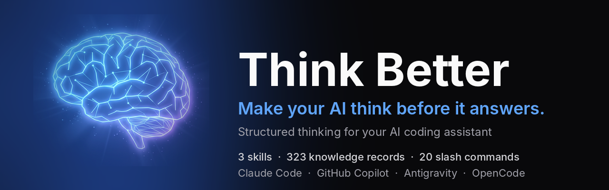

<div align="center">



# Think Better

**Structured thinking for your AI coding assistant: decide with frameworks, solve with root causes, code with evidence.**<br>
One CLI installs three skills and their slash commands so your AI decides with real frameworks,
solves problems with a proven method, and changes code with evidence instead of guesses.

[](https://github.com/HoangTheQuyen/think-better/releases)
[](https://github.com/HoangTheQuyen/think-better/actions/workflows/ci.yml)
[](LICENSE)

**3 skills · 323 knowledge records · 20 slash commands · 4 AI tools**

**Works with** Claude Code · GitHub Copilot · Antigravity · OpenCode

[Website](https://thinkbetter.dev/) · [User Guide](USER-GUIDE.md) · [Quick Reference](QUICK-REFERENCE.md) · [Examples](examples/README.md) · [Changelog](CHANGELOG.md) · [Tiếng Việt](#-tiếng-việt)

</div>

## Install

Pick one:

```bash
# Homebrew (macOS / Linux)
brew tap HoangTheQuyen/think-better https://github.com/HoangTheQuyen/think-better && brew install think-better

# Scoop (Windows)
scoop bucket add think-better https://github.com/HoangTheQuyen/think-better; scoop install think-better

# Install script (macOS / Linux) — installs to ~/.local/bin and verifies the SHA-256 checksum
curl -fsSL https://raw.githubusercontent.com/HoangTheQuyen/think-better/main/install.sh | sh

# Install script (Windows PowerShell) — installs to %LOCALAPPDATA%\think-better
irm https://raw.githubusercontent.com/HoangTheQuyen/think-better/main/install.ps1 | iex

# Go 1.25+
go install github.com/HoangTheQuyen/think-better/cmd/think-better@latest
```

Then, **inside your project**, install the skills for your AI tool:

| AI tool | Command | Skills | Slash commands |
|---------|---------|--------|----------------|
| Claude Code | `think-better init --ai claude` | `.claude/skills/` | `.claude/commands/` |
| GitHub Copilot | `think-better init --ai copilot` | `.github/skills/` | `.github/prompts/*.prompt.md` (agent mode) |
| Antigravity | `think-better init --ai antigravity` | `.agents/skills/` | `.agents/workflows/` |
| OpenCode | `think-better init --ai opencode` | `.opencode/skills/` | `.opencode/commands/` |

Every target gets all three skills and all 20 slash commands (`/solve*`, `/decide*`, `/code*`).
Add `--global` to install once for every project (for GitHub Copilot this installs the skills,
in `~/.copilot/skills/`, but not the slash commands), `--skill code-solving` to install a single
skill with its commands, or `--exclude-command code.perf` to leave out a slash command you do not
want. The skills need **Python 3**
(standard library only); run `think-better check` to verify.

After upgrading the binary, run `think-better update` to refresh every install; files you edited
are kept (see [Updating](#updating)).

<details>
<summary>Pin a version, Nix, source, manual download</summary>

```bash
# Pin a release and pick the directory (no sudo needed)
curl -fsSL https://raw.githubusercontent.com/HoangTheQuyen/think-better/main/install.sh \
  | THINK_BETTER_VERSION=v1.5.0 INSTALL_DIR="$HOME/bin" sh

# Nix
nix run github:HoangTheQuyen/think-better -- init --ai claude

# From source (the binary is written to bin/think-better; run ./bin/think-better init ...)
git clone https://github.com/HoangTheQuyen/think-better && cd think-better && make build
```

Manual download: grab a binary from [Releases](https://github.com/HoangTheQuyen/think-better/releases)
and check it against `checksums.txt`.

</details>

## 30 seconds per skill

Type a slash command, or just describe the problem: the AI also picks the skill from its
description and trigger phrases (see [How a skill is picked](#how-a-skill-is-picked)).
The samples below are real script output for these requests, shortened.

**`/decide`: choose between options**

```
/decide Postgres vs MongoDB vs DynamoDB for our order service

→ Decision type: Multi-Option Selection · Options: Postgres | MongoDB | DynamoDB
→ Framework: Weighted Criteria Matrix (criteria and weights before scoring)
→ Criteria (Tech Stack / Framework Choice): team expertise 25, ecosystem 20, performance 20,
  maintainability 20, cost and licensing 15
→ Bias warnings: Anchoring Effect, Availability Heuristic, Confirmation Bias, each with a remedy
→ A scoring command, a checklist, then next steps: /decide.deep, /decide.exec
```

**`/solve`: get to the root of a business or product problem**

```
/solve Signups dropped 15% after the pricing change

→ Type: Diagnostic · Context: Business Performance
→ Process: Define precisely → Profitability tree → Pareto prioritize → Hypothesis-driven analysis
→ Decomposition: Profitability Tree · Prioritize: Sensitivity Analysis · Analysis: Benchmarking
→ Bias warnings: Confirmation Bias, Narrative Fallacy, Availability Heuristic
→ Communicate with the Pyramid Principle; next steps: /solve.deep, /solve.exec, /decide
```

**`/code`: change code in 7 gated steps**

```
/code.debug Checkout throws after yesterday's deploy when paying with a gift card:
            TypeError: Cannot read properties of undefined (reading 'id')
                at orderTotal (src/checkout/total.js:10:33)
                at payHandler (src/checkout/handler.js:4:17)

→ Context from the project: src/checkout/total.js:10   const discount = cart.coupon.id ? ...
                            src/checkout/handler.js:4  const total = orderTotal(req.session.cart);
→ Known error: TypeError: Cannot read properties of undefined/null (likely causes, what to
  check first, the root-cause fix)
→ Steps: Define (a failing test) → Decompose → Prioritize → Plan → Execute → Verify → Communicate
→ Project checks found: npm run test, npm run lint, npm run build
```

Full walk-throughs: [examples/](examples/README.md).

## The three skills

### `/decide` — make a choice · `make-decision` · 63 records

| | |
|---|---|
| **10 decision frameworks** | Weighted Criteria Matrix, Reversibility Filter, Pre-Mortem, Pros-Cons-Fixes, Expected Value, Scenario Planning… |
| **12 cognitive biases** | Overconfidence, Anchoring, Sunk Cost, Status Quo, Confirmation… with remedies |
| **Comparison matrix** | `--matrix "A vs B vs C"` with weighted criteria |
| **Decision journal** | Record the decision, review it later with the real outcome |

### `/solve` — solve a problem · `problem-solving-pro` · 111 records

| | |
|---|---|
| **7-Step Method** | Define → Disaggregate → Prioritize → Workplan → Analyze → Synthesize → Communicate |
| **18 decomposition frameworks** | Issue Tree, Hypothesis Tree, Profitability Tree, Systems Map… |
| **13 mental models** | First Principles, Inversion, Bayesian Updating, Second-Order Thinking… |
| **10 communication patterns** | Pyramid Principle, BLUF, SCR, Action Titles… |

For bugs and other code changes use `/code`.

### `/code` — change code · `code-solving` · 149 records

| | |
|---|---|
| **7 Steps with Gates** | Define → Decompose → Prioritize → Plan → Execute → Verify → Communicate; each step needs evidence (a failing test, a change map, passing checks) before the next |
| **12 task types** | debug, feature, refactor, performance, flaky-test, incident, migration, review, test, explain, security, quick-fix |
| **Reads your project first** | Maps stack-trace frames to your files and lines, finds where named symbols are defined, lists recent commits; reviews get the diff and the risk areas it touches |
| **44 common error messages** | JS/TS, Python, Go, Java, C#, Rust, SQL and infrastructure: likely causes and what to check first |
| **Your own checks** | Finds the project's test/lint/build commands (npm/pnpm/yarn, Make, Go, Cargo, pytest via uv/Poetry, Maven/Gradle, CI steps…) for the Verify step |
| **Resumable** | Save a step-by-step workspace; `/code.resume` continues at the first unmet gate |

## Slash commands

| Skill | Commands |
|-------|----------|
| problem-solving-pro | `/solve.quick` · `/solve` · `/solve.deep` · `/solve.exec` · `/solve.resume` |
| make-decision | `/decide.quick` · `/decide` · `/decide.deep` · `/decide.exec` · `/decide.resume` |
| code-solving | `/code` · `/code.deep` · `/code.debug` · `/code.feature` · `/code.refactor` · `/code.perf` · `/code.review` · `/code.test` · `/code.explain` · `/code.resume` |

Depth: `.quick` is a fast scan, the plain command is the default, `.deep` adds alternatives and pitfalls
for high-stakes work, `.exec` adds a summary for leadership. `/code` auto-detects the task type;
`/code.deep` is the same with more techniques and the full review checklist.

Add *"save step-by-step"* (Vietnamese: *"lưu từng bước"*) to any request to get a Markdown workspace with one file per step
(`solving-plans/`, `decision-plans/` or `coding-plans/`). Saving again keeps the files you
already filled in.

## Why not just prompt?

You can ask any AI "should we use Postgres or MongoDB?" and get a tidy pros-and-cons list. The
skills add what a prompt alone does not:

- **Structured steps.** Every request runs through a fixed method (7 steps for problems and code,
  a decision plan for choices), so the AI does not jump from symptom to fix.
- **Gates.** `/code` does not move on without evidence: a failing test before the fix, the
  project's own test/lint/build output after it.
- **A knowledge base.** 323 records (frameworks, cognitive biases with remedies, criteria
  templates, 44 known error messages, ...) are searched locally and put into the answer, so the
  advice is specific and the same request gets the same method every time.
- **Saved, resumable workspaces.** Say "save step-by-step" and the work is written to Markdown
  files in your project; `/solve.resume`, `/decide.resume` or `/code.resume` continues at the
  first open step in a later session.

## How a skill is picked

| AI tool | Natural language ("Revenue dropped 20%, why?") | Slash commands |
|---------|-----------------------------------------------|----------------|
| Claude Code | Yes: skills in `.claude/skills/` are picked by their trigger phrases | `.claude/commands/` |
| OpenCode | Yes: skills in `.opencode/skills/` are found by OpenCode's skill tool | `.opencode/commands/` |
| Antigravity | Yes: skills in `.agents/skills/` | `.agents/workflows/` |
| GitHub Copilot | Yes, in agent mode: skills in `.github/skills/` are loaded when a request matches their description | Prompt files in `.github/prompts/` (agent mode) |

Slash commands work in every tool and set the depth for you. Copilot installs made by v1.4.0 or
earlier put the skills in `.github/prompts/<skill>/`, where Copilot does not load them on its own;
`think-better update` moves them to `.github/skills/`.

## How it works

```
You ── "Revenue dropped 20%"  or  /solve.deep …  or  /code.debug …
          │
          ▼
  AI tool (Claude Code · GitHub Copilot · Antigravity · OpenCode)
   ├─ picks the skill: SKILL.md trigger phrases, or the slash command
   └─ runs the skill's script:  python3 <skills dir>/<skill>/scripts/search.py --stdin --plan
          │
          ▼
  Skill engine (local, Python 3 standard library)
   ├─ BM25 search over 323 knowledge records (CSV files shipped with the skill)
   ├─ classify: problem type · decision type · coding task type
   ├─ /code only: read the project (stack-trace frames, symbols, git log, diff, test commands)
   └─ build the plan: framework · steps and gates · bias warnings · checklist
          │
          ▼
  A structured answer + next-step commands (optionally saved as a step-by-step workspace)
```

The CLI only copies Markdown, CSV and Python files into your project (or home directory);
the scripts run locally with no network calls, accounts or API keys.

## CLI

```bash
think-better init        # Install skills and slash commands; re-running it updates the install
think-better update      # Update every install (this project and --global) after upgrading the binary
think-better diff        # Show the new versions (.new) waiting to be merged into files you modified
think-better check       # Python 3, and each install: installed / outdated / modified / incomplete
think-better list        # Skills and where they are installed (every AI tool, project and global)
think-better uninstall   # Remove a skill (--skill) or all of them (--all); keeps files you modified
think-better version     # Show version (also -v, --version)
```

| Flag | Commands | What it does |
|------|----------|--------------|
| `--ai <tool>` | init, update, uninstall, diff | `claude`, `copilot`, `antigravity` or `opencode`. Without it `init` asks (or uses `THINK_BETTER_AI`); `update` and `diff` cover every tool; `uninstall` finds where the skill is installed and asks only when that is several tools |
| `--skill <name>` | init, update, uninstall, diff | One skill: `make-decision`, `problem-solving-pro` or `code-solving` (default: all; `uninstall` needs `--skill` or `--all`) |
| `--all` | uninstall | Remove every installed skill |
| `--global` | init, update, uninstall, diff | Your user account (every project) instead of the current project. GitHub Copilot: the skills only (`~/.copilot/skills/`); its slash commands are installed per project |
| `--force` | init, update | Replace files you modified, after saving yours as `<file>.bak` |
| `--force` | uninstall | Also delete files you modified (and their `.new`), without asking; prints a warning |
| `-y`, `--yes` | uninstall | Do not ask for confirmation (required without a terminal); files you modified are kept |
| `--exclude-command <cmd>` | init, update | Leave out a slash command, e.g. `code.perf` (repeatable or comma-separated; later updates remember it) |
| `--include-command <cmd>` | init, update | Install an excluded slash command again |
| `--dry-run` | init, update, uninstall | Show what would change without writing anything |
| `--context <n>` | diff | Unchanged lines shown around each change (default 3) |
| `--json` | check, list | Machine-readable output |
| `--strict` | check | Also exit 1 when an install is outdated |

`THINK_BETTER_AI=claude` sets the default for `--ai` (and picks the tool for `uninstall` when a
skill is installed for several). `think-better help <command>` shows a command's help.

You can run `update`, `check`, `list`, `uninstall` and `diff` from any folder inside the project:
they look upward for the project's install, up to the repository root and never into your home
directory. `init` installs into the current folder and warns when a parent folder already has an
install. `think-better init --ai claude` run in your home directory is the same as `--global`
(`~/.claude/` is your user-level install).

### Updating

```bash
think-better update --dry-run   # what would change
think-better update             # apply
```

Each install records what it wrote (`.think-better.json` in the skill folder,
`.think-better-workflows.json` next to the slash commands). On `update`, or `init` over an
existing install:

- files you have not modified are replaced with the new version;
- files you modified are kept, and the new version is written next to them as `<file>.new`;
- `--force` replaces them instead, after saving yours as `<file>.bak`;
- files no longer part of a skill are removed, unless you modified them;
- a slash command you deleted is restored, and `update` names it: to keep it out, run
  `think-better update --exclude-command code.perf` (remembered in the workflow manifest;
  `--include-command` brings it back);
- installs made before these manifests existed (v1.3.0 and earlier) are recognized too: files you
  did not change are updated in place, without `.new` or `.bak` files;
- GitHub Copilot skills installed by v1.4.0 or earlier under `.github/prompts/<skill>/` are moved
  to `.github/skills/<skill>/`, files you edited included (with their `.new`); `check` reports
  them as outdated until you do.

Then review what is waiting to be merged:

```bash
think-better diff                     # unified diff: your file (---) against the new version (+++)
mv SKILL.md.new SKILL.md              # take the new version
rm SKILL.md.new                       # or keep yours
think-better update --force           # or take every new version (yours are saved as .bak)
```

`uninstall` likewise deletes only files you have not modified, unless you add `--force`. When it
keeps some, it marks the skill's manifest as uninstalled, so `check` and `update` treat the skill
as not installed and a later `init` installs it fresh.

## Documentation

- [User Guide](USER-GUIDE.md): every skill, workflow and script option in detail, plus
  [Troubleshooting](USER-GUIDE.md#troubleshooting) and [FAQ](USER-GUIDE.md#faq)
- [Quick Reference](QUICK-REFERENCE.md): one-page cheat sheet
- [Examples](examples/README.md): worked decisions, problems and a debugging session
- [Changelog](CHANGELOG.md): what changed in each release
- [Contributing](CONTRIBUTING.md): add a skill, knowledge records, a slash command or an AI tool
  (`make check` runs the same checks as CI)
- [Security](SECURITY.md): report a vulnerability
- Questions and ideas: [Discussions](https://github.com/HoangTheQuyen/think-better/discussions);
  bugs: [Issues](https://github.com/HoangTheQuyen/think-better/issues)

## Roadmap

Directions we are exploring, in no particular order and without dates. Tell us what matters to
you in [Discussions](https://github.com/HoangTheQuyen/think-better/discussions).

- More AI tools, as they add support for skills or custom commands
- More knowledge records (frameworks, known errors, criteria templates) and better
  classification of requests, in English and Vietnamese
- More worked [examples](examples/README.md), including ones from the community

Done: native agent skills for GitHub Copilot (`.github/skills/`), so Copilot picks a skill from
natural language too.

---

<div align="center">

# 🇻🇳 Tiếng Việt

**Tư duy có cấu trúc cho trợ lý AI lập trình: quyết định bằng framework, giải quyết vấn đề tận gốc, sửa code có bằng chứng.**

</div>

Một CLI cài ba skill và các lệnh slash đi kèm, để AI ra quyết định bằng framework thật, giải quyết
vấn đề theo phương pháp rõ ràng và sửa code dựa trên bằng chứng thay vì đoán.

**3 skill · 323 bản ghi kiến thức · 20 lệnh slash · 4 công cụ AI** (Claude Code, GitHub Copilot, Antigravity, OpenCode)

### Cài đặt

```bash
# macOS / Linux
brew tap HoangTheQuyen/think-better https://github.com/HoangTheQuyen/think-better && brew install think-better
curl -fsSL https://raw.githubusercontent.com/HoangTheQuyen/think-better/main/install.sh | sh     # hoặc script

# Windows
scoop bucket add think-better https://github.com/HoangTheQuyen/think-better; scoop install think-better
irm https://raw.githubusercontent.com/HoangTheQuyen/think-better/main/install.ps1 | iex           # hoặc script

# Go 1.25+
go install github.com/HoangTheQuyen/think-better/cmd/think-better@latest

# Trong thư mục project: cài skill cho công cụ AI của bạn
think-better init --ai claude        # hoặc: --ai copilot, --ai antigravity, --ai opencode
think-better init --ai claude --global   # một lần cho mọi project (Copilot: chỉ cài skill, không cài lệnh slash)
```

Cần **Python 3** (chỉ dùng thư viện chuẩn). Kiểm tra bằng `think-better check`.

Sau khi nâng cấp CLI, chạy `think-better update` (thêm `--dry-run` để xem trước) để cập nhật mọi nơi
đã cài. File bạn đã sửa được giữ nguyên, bản mới nằm ngay cạnh với đuôi `.new`: xem khác biệt bằng
`think-better diff`, rồi nhận bản mới (`mv <file>.new <file>`) hoặc giữ bản của bạn (`rm <file>.new`).
Với `--force`, file được thay bằng bản mới và bản của bạn được lưu thành `.bak`. Bản cài từ v1.3.0
trở về trước cũng được nhận ra: file bạn chưa sửa được cập nhật thẳng, không sinh `.new` hay `.bak`.
Skill Copilot do v1.4.0 trở về trước cài trong `.github/prompts/<skill>/` được tự chuyển sang
`.github/skills/<skill>/` (giữ cả file bạn đã sửa).

Không cần lệnh slash nào thì bỏ nó ra bằng `--exclude-command code.perf` (với `init` hoặc `update`;
lần cập nhật sau vẫn nhớ, `--include-command` để cài lại). Các lệnh `update`, `check`, `list`,
`uninstall`, `diff` chạy được từ thư mục con của project: CLI tự tìm lên bản cài của project (tối
đa tới thư mục gốc của repo, không bao giờ lên thư mục home).

### Lệnh CLI

```bash
think-better init        # Cài skill và lệnh slash; chạy lại để cập nhật
think-better update      # Cập nhật mọi bản cài (project này và --global)
think-better diff        # Xem bản mới (.new) đang chờ gộp vào file bạn đã sửa
think-better check       # Kiểm tra Python 3 và trạng thái từng bản cài
think-better list        # Skill nào đang được cài ở đâu
think-better uninstall   # Gỡ một skill (--skill) hoặc tất cả (--all), giữ lại file bạn đã sửa
think-better version     # Xem phiên bản
```

Cờ dùng chung: `--ai`, `--skill`, `--global`, `--force`, `--dry-run`, `--exclude-command` (chi tiết ở
mục [CLI](#cli)). `uninstall` tự tìm skill đang được cài cho công cụ AI nào, không cần `--ai` (chỉ hỏi
khi skill được cài cho nhiều công cụ); `-y`/`--yes` bỏ bước xác nhận nhưng vẫn giữ file bạn đã sửa,
còn `--force` xóa luôn cả file bạn đã sửa (kèm cảnh báo).

### 3 skill

**`/decide`** — Ra quyết định · `make-decision` · 63 bản ghi
- 10 framework quyết định · 12 thiên kiến nhận thức kèm cách khắc phục · Bảng so sánh có trọng số · Nhật ký quyết định

**`/solve`** — Giải quyết vấn đề kinh doanh, sản phẩm · `problem-solving-pro` · 111 bản ghi
- 7 bước: Định nghĩa → Phân tách → Ưu tiên → Lập kế hoạch → Phân tích → Tổng hợp → Trình bày
- 18 framework phân tách · 13 mô hình tư duy · 10 mẫu trình bày

**`/code`** — Sửa và viết code có quy trình · `code-solving` · 149 bản ghi
- 7 bước có "cổng kiểm tra": phải có test fail, chạy test thật, đủ bằng chứng mới qua bước
- 12 loại việc: sửa bug, thêm tính năng, refactor, tối ưu, test chập chờn, sự cố production, nâng cấp, review code, viết test, giải thích code, vá lỗ hổng bảo mật, sửa nhỏ
- Đọc project trước: map stack trace ra file:dòng, tìm nơi định nghĩa hàm/class, commit gần đây; review thì lấy diff và chỉ ra vùng rủi ro
- Nhận ra 44 thông báo lỗi hay gặp (JS/TS, Python, Go, Java, C#, Rust, SQL, hạ tầng) và tự tìm lệnh test/lint/build của project
- Lưu workspace từng bước và làm tiếp ở phiên sau với `/code.resume`

### Lệnh slash

| Skill | Lệnh |
|-------|------|
| problem-solving-pro | `/solve.quick` · `/solve` · `/solve.deep` · `/solve.exec` · `/solve.resume` |
| make-decision | `/decide.quick` · `/decide` · `/decide.deep` · `/decide.exec` · `/decide.resume` |
| code-solving | `/code` · `/code.deep` · `/code.debug` · `/code.feature` · `/code.refactor` · `/code.perf` · `/code.review` · `/code.test` · `/code.explain` · `/code.resume` |

`.quick` quét nhanh, lệnh gốc là mặc định, `.deep` phân tích sâu cho việc quan trọng, `.exec` thêm tóm tắt cho lãnh đạo.

Bạn cứ nói tự nhiên ("Doanh thu giảm 20%, tại sao?"), AI sẽ tự chọn skill, ở cả bốn công cụ. Với
GitHub Copilot, skill nằm trong `.github/skills/` và được nạp ở chế độ agent; lệnh slash là prompt file
trong `.github/prompts/`.

```
/decide.deep Nên dùng AWS hay Azure hay GCP?
/solve.quick Lượt đăng ký giảm 15% sau khi đổi giá
/code.debug Đăng nhập bị lỗi 500 sau khi deploy
/code.feature Thêm xuất file CSV cho trang báo cáo
```

Thêm *"lưu"*, *"lưu lại"* hoặc *"lưu từng bước"* (hoặc *"save step-by-step"*) vào yêu cầu để có workspace Markdown, mỗi bước một
file; ở phiên sau, dùng `/solve.resume`, `/decide.resume` hoặc `/code.resume` để làm tiếp.

### Vì sao không chỉ viết prompt?

- **Quy trình cố định:** mọi yêu cầu đi qua các bước rõ ràng, AI không nhảy thẳng từ triệu chứng sang cách sửa.
- **Cổng kiểm tra:** `/code` chỉ qua bước khi có bằng chứng (test fail trước khi sửa, test/lint/build pass sau khi sửa).
- **Kho kiến thức:** 323 bản ghi kiến thức (framework, thiên kiến kèm cách khắc phục, mẫu tiêu chí, lỗi hay gặp) được tìm ngay trên máy và đưa vào câu trả lời.
- **Workspace lưu lại được:** làm dở thì phiên sau làm tiếp từ bước còn dang dở.

### Lưu ý

- Skill hiểu tiếng Việt trực tiếp, có dấu hay không dấu đều được ("Nên chọn React hay Vue?", "doanh thu giam 20%").
  AI trả lời bằng tiếng Việt và dịch kế hoạch (script in ra bằng tiếng Anh).
- Mọi thứ chạy trên máy bạn: script không gọi mạng, không cần tài khoản hay API key.
- Gặp lỗi? Xem [Troubleshooting](USER-GUIDE.md#troubleshooting) và [FAQ](USER-GUIDE.md#faq) trong User Guide.
- Lộ trình: thêm công cụ AI, thêm bản ghi kiến thức và ví dụ (xem [Roadmap](#roadmap)). Copilot đã hỗ trợ skill trực tiếp.
- Tài liệu chi tiết: [User Guide](USER-GUIDE.md) · [Quick Reference](QUICK-REFERENCE.md) · [Ví dụ](examples/README.md)
- Muốn đóng góp skill/framework mới? Xem [CONTRIBUTING.md](CONTRIBUTING.md) (PR bằng tiếng Việt cũng được).

---

<div align="center">

**MIT License** · Built by [HoangTheQuyen](https://github.com/HoangTheQuyen)

**[⭐ Star](https://github.com/HoangTheQuyen/think-better)** if Think Better helped you think better.

</div>
